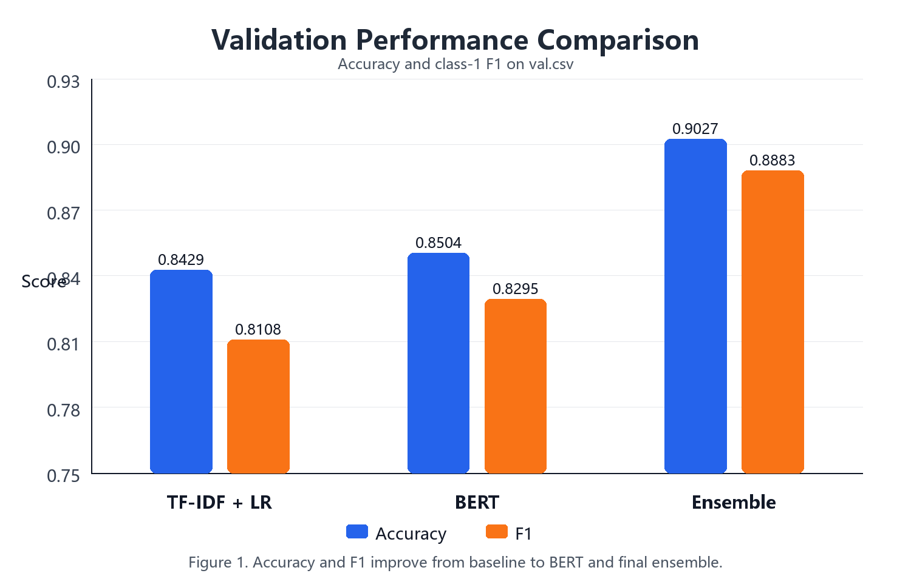

# 2026《人工智能导论》大作业

<center>

**任务名称：** 可解释的谣言检测


**完成组号：** 第 1 组（微信群接龙序号为2）

**小组人员：** 钟睿（组长）、陈依宁、许誉文


**完成时间：** 2026 年 6 月 

</center>

## 1．任务目标

本项目基于英文社交媒体谣言检测数据集 `rumer2026`，构建输入文本后输出检测结果和判断依据的系统。输出包括二分类标签和解释文本，其中 `0` 表示非谣言，`1` 表示谣言。项目关注准确率、运行效率和解释可读性。

## 2．具体内容

### （1）实施方案

项目采用“baseline → Transformer 微调 → 多模型集成”的路线。首先实现 `TF-IDF + Logistic Regression` baseline，打通数据读取、训练和预测流程；随后使用 BERT/RoBERTa 微调，提升语义建模能力；最后结合传统模型和多个 RoBERTa 预测，构建两层多数投票集成，提高准确率和稳定性。

数据集包含 `train.csv` 和 `val.csv`，字段包括 `id`、`text`、`label`、`event`。传统模型使用清洗文本和 TF-IDF 特征；Transformer 模型直接对英文文本分词编码，最大长度为 256。仓库保留 baseline 和 BERT 模型，可直接推理。

### （2）核心代码分析

`src/train_baseline.py` 使用 `TfidfVectorizer` 和 `LogisticRegression` 组成 Pipeline，并输出验证集指标。`src/train_bert.py` 使用 Hugging Face `AutoTokenizer`、`AutoModelForSequenceClassification` 和 `Trainer` 完成 BERT 微调，CUDA 可用时自动使用 GPU。

`src/build_best_cuda_ensemble.py` 负责最终结果复现：先对三个基础预测文件多数投票，再将基础集成与另外两个预测成员做最终投票，生成最终指标和预测文件。`main.py`、`src/predict.py` 提供单条和批量预测入口，`src/explain.py` 生成判断依据。

### （3）检测结果分析（正确率等）

| 方法                                   | Accuracy |               F1 |
| -------------------------------------- | -------: | ---------------: |
| TF-IDF + Logistic Regression(beseline) |   0.8429 | 0.8108（类别 1） |
| BERT 微调                              |   0.8504 | 0.8295（类别 1） |
| 两层多数投票集成                       |   0.9027 |           0.8883 |

baseline 准确率为 0.8429，BERT 微调后提升到 0.8504。最终两层集成在 401 条验证集样本上达到 Accuracy 0.9027、F1 0.8883，其中非谣言类别 F1 为 0.9139，谣言类别 F1 为 0.8883，整体表现较稳定。



### （4）判断依据的分析（可解释性等）

解释模块采用规则化方式生成自然语言依据。对预测为谣言的文本，系统检查是否出现 `breaking`、`urgent`、`unconfirmed` 等谣言相关词，是否包含 `maybe`、`could` 等不确定表达，以及是否缺少 `official`、`confirmed by` 等可靠来源提示。对预测为非谣言的文本，则关注是否有报道来源，以及是否缺少煽动或猜测性表达。系统输出 `Label` 和 `Reason`，使结果更易理解。

示例命令：

```bash
python main.py --text "Breaking news example text" --model-type bert
```

## 3．工作总结

### （1）收获、心得

本项目经历了从 baseline 到深度学习模型再到集成模型的优化过程。baseline 验证流程，BERT/RoBERTa 提升语义建模能力，最终集成进一步提升效果。项目也让我们认识到，课程项目不仅要追求准确率，还要保证代码可运行、结果可复现、文档清晰，并给出解释输出。

分工方面，钟睿（git:Rui2418）负责项目框架、BERT/RoBERTa 训练、CUDA 优化、最终集成和仓库整理；陈依宁（git:alice）负责数据预处理、传统分类器对比、TF-IDF 调参、联合搜索和错误分析；许誉文负责可解释性设计、案例整理、报告素材和展示支持。git贡献见git history。

### （2）遇到问题及解决思路

主要问题包括 CUDA 环境配置、模型文件体积较大、单一模型结果不稳定等。CUDA 问题通过检查 PyTorch 与 CUDA runtime 版本解决；大模型权重通过 Git LFS 管理；稳定性问题通过多模型投票集成缓解。最终仓库支持单条预测、批量预测和最终指标复现。

## 4．课程建议

本次大作业能将机器学习、深度学习和模型评估知识应用到真实文本分类任务中。建议后续课程继续提供类似开放任务，并增加结果复现、实验记录和可解释性评价示例，帮助同学平衡模型效果、工程实现和报告表达。
